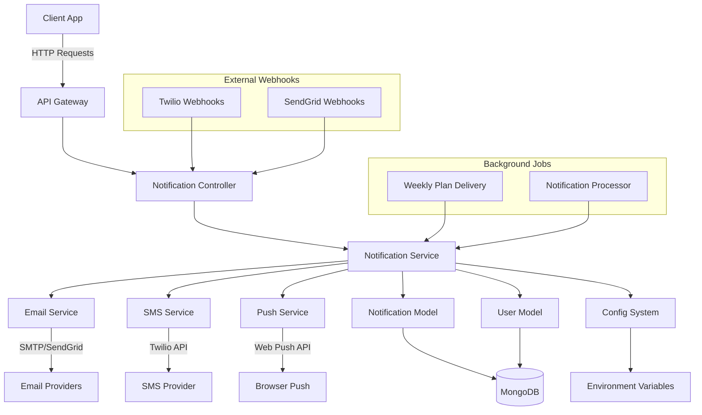

# Analiza Serwisu Powiadomień RunFitting

---

## 1. Architektura Systemu

```
Diagram architektury znajduje się poniżej (w formacie Mermaid):
```



---

## 2. Komponenty Systemu

### 2.1 Warstwa API - 13 Endpointów

**Użytkownik:**
- `GET /api/notifications/preferences` - Pobieranie preferencji
- `PUT /api/notifications/preferences` - Aktualizacja preferencji
- `POST /api/notifications/test` - Testowe powiadomienie
- `GET /api/notifications/history` - Historia powiadomień
- `GET /api/notifications/stats` - Statystyki użytkownika
- `GET /api/notifications/status` - Status serwisów

**Push Notifications:**
- `POST /api/notifications/push/subscribe` - Subskrypcja push
- `DELETE /api/notifications/push/unsubscribe` - Wypisanie
- `GET /api/notifications/push/vapid-keys` - Klucze VAPID

**Administracyjne:**
- `POST /api/notifications/send` - Wysyłka admin (tylko admin)
- `POST /api/notifications/schedule` - Planowanie (tylko admin)
- `POST /api/notifications/process-pending` - Przetwarzanie (system)
- `POST /api/notifications/webhook/:provider` - Webhooks

### 2.2 Warstwa Serwisów

**Email Service (Nodemailer):**
- SMTP/SendGrid integration
- Szablony HTML/TEXT
- Rate limiting (1000/day, 100/hour)
- Retry mechanism
- Template caching
- Unsubscribe links

**SMS Service (Twilio):**
- Twilio API integration
- Template system (160 chars)
- Phone validation
- Rate limiting (100/day, 20/hour)
- International numbers
- Status webhooks

**Push Service (Web Push):**
- VAPID authentication
- Chrome/Firefox/Safari support
- Rich notifications (actions, images)
- TTL management
- Subscription validation
- Rate limiting (2000/day, 200/hour)

### 2.3 Model Danych

**Notification Schema:**
```js
{
  userId: ObjectId,           // Odbiorca
  type: String,              // training_reminder, achievement, etc.
  channel: String,           // email, sms, push
  status: String,            // pending, sent, delivered, failed
  priority: String,          // low, normal, high, urgent
  content: {
    title: String,
    body: String,
    metadata: Object         // Dodatkowe dane
  },
  targetData: Object,        // Email, phone, push subscription
  attempts: Array,           // Historia prób wysłania
  deliveryData: Object,      // Tracking delivery
  scheduledFor: Date,        // Zaplanowane wysłanie
  category: String,          // reminder, marketing, transactional
  userSegment: String        // premium, free, etc.
}
```

---

## 3. Typy Powiadomień

**Treningowe:**
- `training_reminder` - Przypomnienia o treningach
- `progress_report` - Raporty postępów
- `achievement` - Osiągnięcia użytkownika
- `plan_update` - Aktualizacje planów

**Systemowe:**
- `system_notification` - Informacje systemowe
- `motivational_message` - Wiadomości motywacyjne
- `welcome_message` - Powitanie nowych użytkowników
- `subscription_reminder` - Informacje o subskrypcji

---

## 4. Konfiguracja i Zmienne Środowiskowe

**Email (SMTP/SendGrid):**
```
SMTP_HOST=smtp.gmail.com
SMTP_PORT=587
SMTP_USER=your_email@gmail.com
SMTP_PASS=app_password
EMAIL_FROM=RunFitting <noreply@runfitting.com>
```

**SMS (Twilio):**
```
TWILIO_ACCOUNT_SID=ACxxxxx
TWILIO_AUTH_TOKEN=your_token
TWILIO_FROM_NUMBER=+1234567890
TWILIO_MESSAGING_SERVICE_SID=MGxxxxx
```

**Push (VAPID):**
```
VAPID_PUBLIC_KEY=... (własny klucz)
VAPID_PRIVATE_KEY=... (własny klucz)
VAPID_SUBJECT=mailto:support@runfitting.com
```

---

## 5. Bezpieczeństwo i Limity
- JWT/Supabase auth middleware
- Limity dzienne/godzinne na kanał i użytkownika
- Retry policy i obsługa błędów
- Webhooki do statusów (Twilio, SendGrid)
- Weryfikacja subskrypcji push

---

## 6. Rozszerzalność
- Łatwe dodanie nowych kanałów (np. WhatsApp, Messenger)
- Szablony i konfiguracja w jednym miejscu
- Możliwość segmentacji użytkowników i A/B testów

---

**Stan na:** {{DATA_GENERACJI}} 